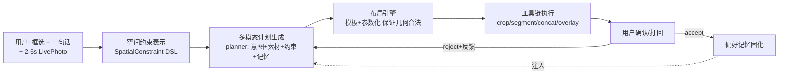

# LivePhoto Agent 开题文档（实习长期课题 · 4-6 个月）

> 定位：空间约束驱动的个性化 LivePhoto 编辑 Agent。
> 一句话价值：让用户"框一下 + 说一句"，就能对 2-5s 的 Live Photo 完成可控、可解释、越用越个性化的拼接与编辑。

---

## 0. 为什么这份文档里的方向是"调研过的"，不是拍脑袋的

每个主攻方向都先回答三个问题：**前人做到了什么程度 → 我们借什么 → 剩下什么空间是我们的**。
所有引用的前人工作均已核实（arXiv/顶会），且全部支持"冻结基模、不训练"的工程路线——这保证课题在没有训练资源的前提下依然有真实产出。

### 0.1 文献调研结论速览

| 方向 | 代表工作 | 对我们的直接启示 | 他们没做的（我们的空间） |
|---|---|---|---|
| LLM 布局生成 | LayoutGPT (NeurIPS 2023, [arXiv:2305.15393](https://arxiv.org/abs/2305.15393)) | LLM + CSS 风格 in-context 示例即可生成合理 2D 布局，**冻结模型可用**；评测用"数值/空间关系正确率"这类硬指标 | 只做静态图布局，没有时序（Live Photo 的 2-5s 动态段如何排布）；没有"用户已有素材"的约束 |
| 布局即代码 | LayoutNUWA ([arXiv:2309.09506](https://arxiv.org/abs/2309.09506)) | 把布局生成当**代码生成**（HTML+mask 补全），可解释、可渲染、可校验 | 同上；且面向海报/文档，不面向照片拼接 |
| 视觉标记提示 | Set-of-Mark / SoM ([arXiv:2310.11441](https://arxiv.org/abs/2310.11441)) | 在图上叠加编号/框/mask 后送入 VLM，zero-shot grounding 能力大幅提升（RefCOCOg 上超过 finetuned SOTA）——**框选交互不需要模型原生支持 bbox 传参** | 只验证理解侧；没有把 SoM 用于"编辑计划生成"的闭环 |
| 坐标进对话 | Kosmos-2 ([arXiv:2306.14824](https://arxiv.org/abs/2306.14824))、Shikra ([arXiv:2306.15195](https://arxiv.org/abs/2306.15195))、Ferret ([arXiv:2310.07704](https://arxiv.org/abs/2310.07704))、Qwen-VL ([arXiv:2308.12966](https://arxiv.org/abs/2308.12966)) | 归一化坐标可以直接作为文本 token 进出对话；Qwen 系（我们的 planner 基座）原生有 grounding 能力 | 均为单图静态理解；无工具编排闭环 |
| 框/点提示分割 | SAM ([arXiv:2304.02643](https://arxiv.org/abs/2304.02643))、SAM 2 ([arXiv:2408.00714](https://arxiv.org/abs/2408.00714)) | 框 → mask 的成熟通道；SAM 2 支持视频时序传播（首帧框，全段跟踪） | 重依赖，端侧/沙箱部署成本高 → 我们用 OpenCV 兜底 + 可插拔升级 |
| 工具编排 Agent | Visual ChatGPT ([arXiv:2303.04671](https://arxiv.org/abs/2303.04671))、HuggingGPT ([arXiv:2303.17580](https://arxiv.org/abs/2303.17580)) | LLM 做 planner、视觉工具做 executor 的范式已验证；框应先进工具层而非硬塞进 LLM | 无个性化、无记忆、无人工确认闭环 |
| 编辑评测集 | MagicBrush (NeurIPS 2023, [arXiv:2306.10012](https://arxiv.org/abs/2306.10012)) | **人工标注的评测集本身就是被顶会认可的贡献**；评测维度=定量+定性+人评 | 面向单图 diffusion 编辑；无"同指令不同素材应产生不同计划"的消歧维度 |
| Agent 记忆 | MemGPT ([arXiv:2310.08560](https://arxiv.org/abs/2310.08560)) | 分层记忆（主上下文/外部存储）+ 多 session 评测方法可直接借鉴 | 通用对话记忆；无"用户确认后才固化"的门控，无多模态偏好记忆 |

### 0.2 工程现状盘点（本仓库已有的资产）

| 资产 | 位置 | 状态 |
|---|---|---|
| 画布交互（画笔/矩形框） | [src/live_photo_agent/ui.html](src/live_photo_agent/ui.html)（`interactiveCanvas`、`canvasModeSelect`） | 前端已有，但**点集/框坐标未随请求上传**（只传了意图文本），这是第一个要补的洞 |
| 请求协议 | [src/live_photo_agent/models.py](src/live_photo_agent/models.py)（`AgentRequest.layout_context/operation_log`） | 有布局上下文通道，缺结构化 bbox 字段 |
| 分割/抠像工具链 | [src/live_photo_agent/foundation/media_ops.py](src/live_photo_agent/foundation/media_ops.py)（`segment_subject` GrabCut 矩形初始化、`extract_subject_matte_frames` 背景差分） | GrabCut 天然支持"矩形框初始化"，**框选一接上就能用，零新依赖** |
| 空间拼接执行 | `concat_clips`（layout/canvas 参数）、`overlay_subject_clip`（anchor/scale/offset） | 布局 DSL 的执行端已有雏形 |
| planner 双后端 | [src/live_photo_agent/brain.py](src/live_photo_agent/brain.py)（Qwen endpoint / local_hf） | 可复现实验的基础 |
| 评测基建 | [tests/evals/](tests/evals/)（`planner_eval_set_50.jsonl`、`intent_stage_a_eval.py`、`run_planner_eval.py`） | 已有 50 条 planner 评测集 + 报告产出脚本，**扩展它而不是新建** |
| 记忆门控闭环 | [src/live_photo_agent/foundation/memory.py](src/live_photo_agent/foundation/memory.py)（accept 后才写长期记忆、reject→retry 回路） | 骨架已完成，缺"记忆注入 planner"的消融验证 |
| 已知约束 | mediapipe 在本环境不可用（protobuf 冲突）；分割走 OpenCV-only 路线 | 已验证，见仓库记忆 |

**结论：课题不是从零开始，而是"把已有的 70% 串成一条有数字支撑的主线"。**

---

## 1. 课题主线与支撑（收敛后的结构）

原始设想是三个并列方向（意图识别 / 空间布局 / 记忆管理）。风险是三线作战、每块都停留在 demo。
收敛为 **一条主线 + 两个支撑**：

### 1.1 主线（约 60% 精力）：空间约束驱动的多模态计划生成

**问题定义**：给定 (a) 用户指令，(b) 1-N 个 2-5s LivePhoto 素材，(c) 可选的矩形框约束（输入侧），生成一个**几何合法、约束满足、可执行**的编辑/拼接计划（输出侧含布局）。

**为什么值得做（调研支撑）**：
- VLM 直接输出自由坐标的可靠性天花板低（LayoutGPT 用结构化 in-context 才可用；LayoutNUWA 干脆转成代码补全）→ 说明"**模型选模板+填参数，引擎保几何**"是正确路线，不是偷懒。
- SoM 证明"框叠图+编号"能让冻结 VLM 获得强 grounding → 我们的框选交互有两条实现通道（结构化坐标进 prompt / 标记图进视觉输入），可以做**对比实验**，这本身就是有价值的消融。
- 前人（LayoutGPT/NUWA）只做静态布局，**"含时序段的素材拼接布局"（哪段动态放哪个位置、先后如何编排）没人系统做过**——这是真实的差异化空间，且恰好被 LivePhoto 场景天然定义。

**具体工作项**：
1. **SpatialConstraint DSL v1**：统一输入侧（用户框选）和输出侧（布局计划）的空间表示。字段至少含：归一化 bbox、z 顺序、时间段（start_ms/end_ms）、对齐/边距约束、strict 模式（是否严格框内）。
2. **前端补洞**：`ui.html` 画布的矩形框坐标随 `AgentRequest` 上传（新增 `spatial_constraints` 字段）；GrabCut `segment_subject` 从"固定中央矩形初始化"改为"用户框初始化"——这是零新依赖、立刻见效的第一步。
3. **布局生成两通道对比**：
   - 通道 A：结构化坐标以文本形式进 planner prompt（Kosmos-2/Shikra 范式）；
   - 通道 B：SoM 式标记图（框+编号叠加在素材缩略图上）进 VLM 视觉输入；
   - 用同一评测集对比两通道的约束满足率——**这组消融是本课题的核心实验之一**。
4. **布局引擎硬化**：模板库（timeline/横竖拼/三联/画中画）+ 参数校验（越界裁剪、重叠检测、最小可读尺寸），保证"planner 输出的任何计划渲染不炸"。

### 1.2 支撑一（约 25% 精力）：多模态意图消歧评测集与基线

**问题定义**：同一句指令，在不同素材/不同框选/不同用户偏好下应产生不同计划。纯文本意图分类已无研究空间（大模型 few-shot 即 85%+），但"**上下文依赖的意图消歧**"仍是硬问题。

**为什么值得做（调研支撑）**：
- MagicBrush 证明"精心人工标注的评测集"是顶会认可的独立贡献（10K 三元组，NeurIPS 2023）；我们做 100-200 条量级的消歧评测集，作为实习产出规模合理。
- 本仓库已有 `planner_eval_set_50.jsonl` + 评测脚本，扩展成本低。

**具体工作项**：
1. 评测集设计：每条样本 = {指令, 素材描述/指纹, 可选框, 期望意图+期望计划要点}；重点覆盖三类歧义——**素材依赖**（"拼好看点"在 2 张 vs 5 张素材下）、**空间依赖**（"把这个放大"有框 vs 无框）、**偏好依赖**（同句在不同历史偏好下）。
2. 基线与提升：直接 planner vs +澄清策略（低置信必反问）vs +素材信号注入，报告"计划正确率 / 澄清触发精度 / 澄清后一次成功率"。
3. 交付物：评测集 JSONL + 复现脚本 + 基线报告（并入 [tests/evals/](tests/evals/) 现有体系）。

### 1.3 支撑二（约 15% 精力）：确认门控的偏好记忆及其消融

**问题定义**：不是做通用记忆系统（MemGPT 已做），而是回答一个窄而实的问题：**"用户确认后固化的偏好记忆，能否可量化地提升后续计划质量？"**

**为什么值得做（调研支撑）**：
- MemGPT 的多 session 评测方法可直接借鉴，但它没有"人工确认才写入"的门控——本仓库已实现该门控（`MemoryService.confirm_feedback`），差的只是**证明它有用的实验**。
- 真实多用户长周期数据在实习期内拿不到 → 用**模拟用户协议**（预设 3-5 个偏好画像，脚本化多轮交互）做消融，这在 agent 记忆文献中是标准做法。

**具体工作项**：
1. 记忆注入策略：偏好记忆以结构化摘要形式进 planner prompt（数量上限、相关性过滤）。
2. 消融实验：同一评测集在 {无记忆 / 有记忆 / 有噪声记忆} 三种条件下的计划质量对比，额外报告**记忆误伤率**（错误偏好导致计划变差的比例）。
3. 可撤销机制：偏好查看/删除接口（工程量小，产品完整性必需）。

---

## 2. 非目标（防止课题膨胀）

1. **不训练/微调任何模型**——全部走冻结基模 + 提示工程 + 工具编排；这是经过调研验证可行的路线（SoM/LayoutGPT/Visual ChatGPT 均为冻结模型）。
2. **不做通用生图/diffusion 编辑**——像素级生成质量不是本课题的评价对象；编辑操作限于现有工具链（裁剪/分割/拼接/叠加/调色/字幕）。
3. **不做美学评价模型**——布局质量用硬指标（合法率/约束满足率）兜底，主观美感只做小规模人评辅助。
4. **不做任意形状涂抹交互**——输入侧只支持矩形框（已论证：语义稳定、结构化、成本低），线条/涂抹留作展望。
5. **不承诺真实多用户上线数据**——个性化验证用模拟用户协议。

---

## 3. 里程碑（按 5 个月排布，可伸缩至 4-6 个月）

| 阶段 | 时间 | 目标 | 验收物 |
|---|---|---|---|
| M1 框选闭环 | 第 1-4 周 | 前端框坐标上传 → `AgentRequest.spatial_constraints` → GrabCut 框初始化分割 → 计划与执行结果携带框引用 | 端到端 demo：框选人物 + "把他抠出来贴到另一张上"一次成功；协议字段文档 |
| M2 布局 DSL 与引擎 | 第 4-8 周 | SpatialConstraint DSL v1 定稿；模板库 + 几何校验；planner 输出接 DSL | 布局合法率 ≥ 99%（引擎校验兜底）；10 个模板玩法可渲染 |
| M3 双通道消融 + 消歧评测集 | 第 8-14 周 | 坐标进 prompt vs SoM 标记图对比实验；消歧评测集 100-200 条 + 三组基线 | 消融报告（约束满足率对比）；评测集 + 复现脚本合入 tests/evals |
| M4 记忆消融 + 总集成 | 第 14-18 周 | 记忆注入策略 + 三条件消融；全链路联调与回归 | 记忆消融报告；端到端演示脚本；回归测试通过 |
| M5 收尾 | 第 18-20 周 | 文档、答辩材料、专利/分享交底 | 技术报告 + 开题对照的验收核对表 |

**每个里程碑独立可交付**：即使课题在 M2/M3 后被砍或调向，已完成部分仍是完整成果。

---

## 4. 量化指标（答辩时用数字说话）

| 指标 | 定义 | 目标 |
|---|---|---|
| 布局合法率 | 渲染无越界/无意外全遮挡/无空布局的比例 | ≥ 99%（引擎兜底后） |
| 空间约束满足率 | 用户框/位置要求在产物中被满足的比例（IoU 或位置断言） | ≥ 85%，且报告双通道差异 |
| 意图计划正确率 | 消歧评测集上计划要点匹配率 | 基线 +10pp 以上的可测提升 |
| 澄清触发精度 | 触发澄清的样本中真歧义占比 | ≥ 80%（避免瞎问） |
| 记忆增益 | 有记忆 vs 无记忆的计划正确率差 | 显著为正，且误伤率 < 5% |
| 一次通过率 | 用户（模拟）不打回的比例 | 相对基线提升，趋势即可 |

---

## 5. 风险与降级方案

| 风险 | 概率 | 降级方案 |
|---|---|---|
| planner 基座 grounding 能力不足，坐标通道效果差 | 中 | SoM 标记图通道兜底（调研已证冻结 VLM + 标记图可行）；两通道对比本身就是成果 |
| 布局自由生成不可靠 | 高（预期内） | 已设计为"模板+参数"，模型永远不直接产原始坐标 |
| VLM 端点不稳定/配额限制 | 中 | local_hf 后备已就绪；评测固定素材与随机种子 |
| 消歧评测集标注量不够 | 中 | 优先质量：100 条高质量歧义样本 > 500 条平凡样本；用素材程序化组合扩增 |
| 记忆实验被质疑"模拟不真实" | 中 | 明示协议假设与局限；补 3-5 人小规模真人试用作定性佐证 |
| 分割质量上限（OpenCV-only） | 低 | 框选场景 GrabCut 足够；预留 SAM 可插拔接口但不承诺 |

---

## 6. 预期产出清单（对实习生个人）

1. **系统**：可演示的框选驱动 LivePhoto 编辑 Agent（端到端，含人工确认与记忆闭环）。
2. **数据资产**：多模态意图消歧评测集（可开源/可内部沉淀）。
3. **实验报告**：三组核心消融（空间双通道 / 澄清策略 / 记忆增益），每组都有数字结论。
4. **可写进简历的一句话**："设计并验证了空间约束驱动的多模态 agent 计划生成方案，在自建评测集上将约束满足率/计划正确率提升 X%。"
5. **可选延伸**：技术分享 / 专利交底书 /（若消融结论足够干净）workshop 短文。

---

## 7. 参考文献

1. LayoutGPT: Compositional Visual Planning and Generation with LLMs. NeurIPS 2023. arXiv:2305.15393
2. LayoutNUWA: Revealing the Hidden Layout Expertise of LLMs. arXiv:2309.09506
3. Set-of-Mark Prompting Unleashes Extraordinary Visual Grounding in GPT-4V. arXiv:2310.11441
4. Kosmos-2: Grounding Multimodal LLMs to the World. arXiv:2306.14824
5. Shikra: Unleashing Multimodal LLM's Referential Dialogue Magic. arXiv:2306.15195
6. Ferret: Refer and Ground Anything Anywhere at Any Granularity. arXiv:2310.07704
7. Qwen-VL: A Versatile Vision-Language Model. arXiv:2308.12966
8. Segment Anything. arXiv:2304.02643 / SAM 2. arXiv:2408.00714
9. Visual ChatGPT. arXiv:2303.04671 / HuggingGPT. arXiv:2303.17580
10. MagicBrush: A Manually Annotated Dataset for Instruction-Guided Image Editing. NeurIPS 2023. arXiv:2306.10012
11. MemGPT: Towards LLMs as Operating Systems. arXiv:2310.08560
12. GrabCut: Interactive Foreground Extraction using Iterated Graph Cuts. SIGGRAPH 2004.
13. The Dawn of LMMs: Preliminary Explorations with GPT-4V(ision). arXiv:2309.17421
